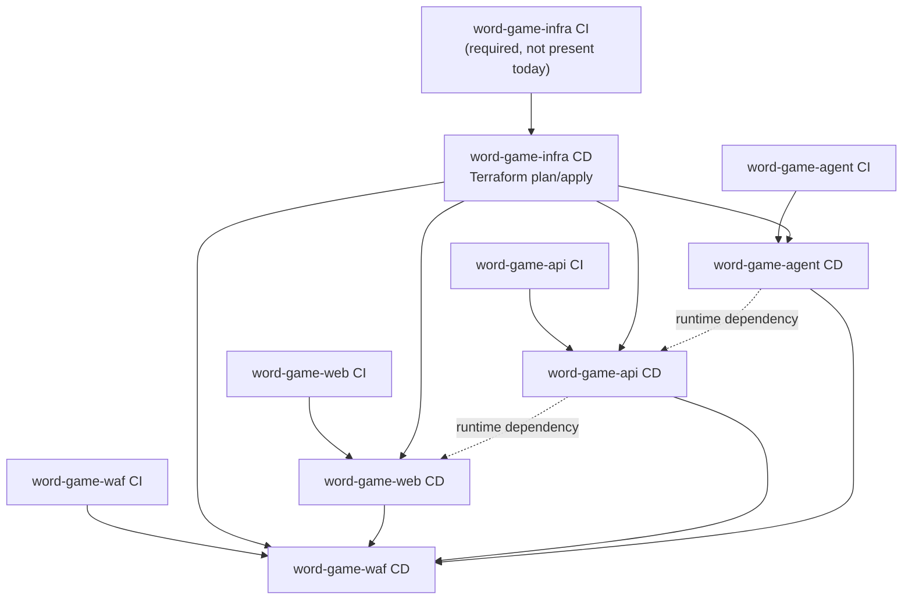

# CI/CD Dependency Analysis

This document summarizes the current CI/CD workflows in the child repos, compares them to the declared requirements, and documents the intended cross-repo deployment order.

## Sources reviewed

- `word-game-web/.github/workflows/ci.yml`
- `word-game-web/.github/workflows/cd.yml`
- `word-game-api/.github/workflows/ci.yml`
- `word-game-api/.github/workflows/cd.yml`
- `word-game-agent/.github/workflows/ci.yml`
- `word-game-agent/.github/workflows/cd.yml`
- `word-game-waf/.github/workflows/ci.yml`
- `word-game-waf/.github/workflows/cd.yml`
- `.requirements/cicd.yml`
- `.requirements/deployment-updates.yml`
- `.copilot/guardrails/nfr.yml` (devops section)
- `.copilot/guardrails/pattern.yml`

## Executive summary

- **Declared target state:** infra deploys first, then service deploys; all CI/CD runs on **self-hosted** runners; CD uses **OIDC**; images are pushed with both `:sha` and `:latest`.
- **Current state:** each repo mostly has its own CI→CD chain, but **cross-repo ordering is not automated**.
- **Biggest gaps vs requirements:**
  - `word-game-infra` has **no workflows yet**
  - some jobs still use **GitHub-hosted runners**
  - most CI pipelines are missing **security scans**
  - `word-game-waf` CD does **not push `:latest`**
  - service CDs do **in-place `az containerapp update`**, which does not yet match the new **SHA-named Container App** pattern

## 1. Dependency graph

### Current intended release order



### Practical deployment order

```text
1. word-game-infra
2. word-game-agent
3. word-game-api
4. word-game-web
5. word-game-waf
```

Why this order:

- **infra first**: all service CDs depend on Azure resources created outside the service repos
- **agent before api**: API features trigger/use agent functionality
- **api before web**: the SPA depends on backend availability
- **waf last**: it is the public entry point and depends on healthy upstreams

### Current automation reality

Today, only the **per-repo** dependency is enforced:

```text
repo CI success on main -> same repo CD
```

There is **no current workflow-level enforcement** for:

- infra CD completing before service CDs
- agent CD completing before api CD
- api/web CD completing before waf CD

## 2. Per-repo CI pipeline breakdown

### word-game-web

- **Trigger:** `push` and `pull_request` on `main` and `develop`
- **Runner:** self-hosted
- **Jobs:** `lint`, `test`, `build`
- **Execution order:** jobs run **in parallel** today (no `needs`)

Pipeline detail:

1. `lint`
   - checkout
   - setup Node.js 20
   - `npm ci`
   - `npm run lint`
2. `test`
   - checkout
   - setup Node.js 20
   - `npm ci`
   - `npm test`
3. `build`
   - checkout
   - setup Node.js 20
   - `npm ci`
   - `npm run build`
   - upload `dist/` artifact

Observed gaps:

- missing security scan stage
- branch scope includes `develop`, while guardrails emphasize trunk-based `main`
- lint does **not** gate test/build; fail-fast is not fully implemented

### word-game-api

- **Trigger:** `pull_request`, `push` on `main`
- **Runner:** self-hosted
- **Jobs:** `test`
- **Execution order:** single job, sequential steps

Pipeline detail:

1. checkout
2. setup Python 3.12
3. `pip install -r requirements.txt pytest ruff`
4. `ruff check .`
5. `ruff format --check .`
6. `python3 -m pytest tests/`

Observed gaps:

- no dedicated security scan stage
- no explicit build/packaging step
- lint and tests are sequential inside one job rather than separate gated stages

### word-game-agent

- **Trigger:** `push` and `pull_request` on `main` and `develop`
- **Runners:** mixed (`ubuntu-latest` for lint, self-hosted for tests)
- **Jobs:** `lint`, `test`
- **Execution order:** jobs run in parallel today

Pipeline detail:

1. `lint`
   - checkout
   - setup Python 3.11
   - `pip install ruff`
   - `ruff check .`
   - `ruff format --check .`
2. `test`
   - checkout
   - setup Python 3.11
   - `pip install -r requirements.txt`
   - `python3 -m pytest tests/ -v --cov=src --cov-report=xml`
   - upload coverage to Codecov

Observed gaps:

- `lint` violates guardrails by using **GitHub-hosted** runner
- missing security scan stage
- branch scope includes `develop`
- no explicit build/container validation stage
- lint does not gate tests

### word-game-waf

- **Trigger:** `pull_request`, `push` on `main`
- **Runner:** self-hosted
- **Jobs:** `validate`
- **Execution order:** single job, sequential steps

Pipeline detail:

1. checkout
2. `docker build -t word-game-waf:ci .`
3. run container with `--check` to validate nginx syntax
4. start container locally
5. poll `/health`
6. cleanup container

Observed gaps:

- no explicit security scan stage
- no separate lint/scan/test/build gates
- no artifact publication

### word-game-infra

- **Current state:** no `.github/workflows/*.yml` present
- **Required target per requirements/guardrails:**
  1. terraform fmt
  2. terraform validate
  3. security scanning (`checkov`, `semgrep`)
  4. PR plan / main-branch deploy path
  5. separate CD workflow for plan + apply via OIDC

This is the largest current-state gap because all service CDs assume infra already exists.

## 3. Per-repo CD pipeline breakdown

### word-game-web

- **Trigger:** `workflow_run` after `CI` completes on `main`
- **Runner:** self-hosted
- **Gate:** `github.event.workflow_run.conclusion == 'success'`
- **Auth:** `azure/login@v1` with OIDC

Pipeline detail:

1. checkout
2. setup Node.js 20
3. `npm ci`
4. `npm run build`
5. Azure login
6. local Docker build: `word-game-web:${github.sha}`
7. ACR login using `ACR_NAME`
8. retag/push:
   - `word-game-web:${github.sha}`
   - `word-game-web:latest`
9. in-place deploy:
   - `az containerapp update --name word-game-web --resource-group $RESOURCE_GROUP --image ...:${github.sha}`

Dependencies:

- successful `word-game-web` CI on `main`
- existing ACR
- existing resource group
- existing Container App named `word-game-web`

Observed gaps:

- no explicit infra-success dependency
- uses `github.sha` instead of `github.event.workflow_run.head_sha`
- hardcodes Container App name
- no image scan before push

### word-game-api

- **Trigger:** `workflow_run` after `CI` completes on `main`
- **Runner:** self-hosted
- **Gate:** `github.event.workflow_run.conclusion == 'success'`
- **Auth:** `azure/login@v2` with OIDC

Pipeline detail:

1. checkout
2. Azure login
3. build/push image using:
   - `ACR_LOGIN_SERVER`
   - `ACR_IMAGE_NAME`
   - tags `${github.sha}` and `latest`
4. in-place deploy:
   - `az containerapp update --resource-group $AZURE_RESOURCE_GROUP --name $CONTAINER_APP_NAME --image ...:${github.sha}`

Dependencies:

- successful `word-game-api` CI on `main`
- existing ACR
- existing resource group
- existing Container App

Observed gaps:

- no explicit infra-success dependency
- uses `github.sha` instead of `github.event.workflow_run.head_sha`
- no image scan before push

### word-game-agent

- **Trigger:** `workflow_run` after `CI` completes on `main`
- **Runner:** `ubuntu-latest`
- **Gate:** `github.event.workflow_run.conclusion == 'success'`
- **Auth:** `azure/login@v2` with OIDC

Pipeline detail:

1. checkout using `github.event.workflow_run.head_branch`
2. Azure login
3. build image twice:
   - `${ACR_NAME}.azurecr.io/word-game-agent:${github.sha}`
   - `${ACR_NAME}.azurecr.io/word-game-agent:latest`
4. ACR login and push both tags
5. in-place deploy:
   - `az containerapp update --name word-game-agent --resource-group $AZURE_RESOURCE_GROUP --image ...:${github.sha}`

Dependencies:

- successful `word-game-agent` CI on `main`
- existing ACR
- existing resource group
- existing Container App named `word-game-agent`

Observed gaps:

- violates guardrails by using **GitHub-hosted** runner
- checkout is pinned to **branch**, not the exact tested `head_sha`
- image tag uses `github.sha` instead of tested `workflow_run.head_sha`
- no explicit infra-success dependency
- no image scan before push

### word-game-waf

- **Trigger:** `workflow_run` after `CI` completes
- **Runner:** `ubuntu-latest`
- **Gate:** success + `head_branch == 'main'`
- **Auth:** `azure/login@v2` with OIDC

Pipeline detail:

1. checkout using exact `workflow_run.head_sha`
2. Azure login
3. build and push image:
   - full image = `${ACR_NAME}.azurecr.io/${ACR_REPOSITORY}:${workflow_run.head_sha}`
4. in-place deploy:
   - `az containerapp update --name $CONTAINER_APP_NAME --resource-group $CONTAINER_APP_RESOURCE_GROUP --image $FULL_IMAGE`

Dependencies:

- successful `word-game-waf` CI on `main`
- existing ACR
- existing resource group
- existing WAF Container App
- correct upstream service endpoints already existing

Observed gaps:

- violates guardrails by using **GitHub-hosted** runner
- pushes only `:sha`; **missing `:latest`**
- no explicit infra-success dependency
- no explicit dependency on web/api readiness, even though WAF fronts them
- no image scan before push

### word-game-infra

- **Current state:** no CD workflow present
- **Required target state:** `workflow_run` after infra CI success on `main`, then:
  1. Azure login via OIDC
  2. Terraform init
  3. Terraform plan
  4. Terraform apply
  5. completion signal for downstream service CDs

Without this workflow, the required “infra deploys first” rule is not enforced by automation.

## 4. Cross-repo dependency analysis

### Hard dependencies

These dependencies must exist for deployments to succeed:

1. **Infrastructure before every service**
   - ACR must exist before image push
   - resource groups must exist before deploy
   - Container Apps environment/networking/identity must exist before service rollout
   - current service CDs use `az containerapp update`, so the target Container App must already exist

2. **Current service CDs depend on infra-managed app bootstrapping**
   - because the service workflows only update existing apps, they cannot bootstrap a missing app
   - this matches the current requirement note that Container Apps are still effectively rooted in infra

3. **WAF depends on service availability**
   - WAF is the public entry point
   - it should only cut over after web and API backends are healthy
   - if service names/FQDNs change, WAF must be updated after those new endpoints exist

4. **API depends on agent for AI/category workflows**
   - the requirements describe API endpoints that trigger the agent
   - coordinated releases should treat agent→API as an ordered dependency when those contracts change

5. **Web depends on API**
   - the SPA can deploy independently from a Git perspective
   - operationally, it is safer to have the target API already available before exposing new frontend code

### What is enforced today vs what is only implied

| Dependency | Enforced today? | Notes |
| --- | --- | --- |
| same-repo CI before same-repo CD | Yes | via `workflow_run` |
| infra before services | No | required, but not automated |
| agent before api | No | runtime dependency only |
| api before web | No | runtime dependency only |
| web/api before waf | No | operational dependency only |

### Recommended coordinated release order

For a full platform release:

1. **word-game-infra**
2. **word-game-agent**
3. **word-game-api**
4. **word-game-web**
5. **word-game-waf**

For a partial release:

- **agent-only change:** deploy agent, then api only if contract/config changed
- **api-only change:** deploy api, then web if frontend contract changed, then waf if routing/config changed
- **web-only change:** deploy web, then waf only if WAF config or upstream mapping changed
- **waf-only change:** deploy waf only after confirming current upstream web/api targets are healthy

## 5. Secrets inventory by repo

### Current workflow-referenced secrets

| Repo | Secrets referenced | Notes / inconsistencies |
| --- | --- | --- |
| `word-game-web` | `AZURE_CLIENT_ID`, `AZURE_TENANT_ID`, `AZURE_SUBSCRIPTION_ID`, `ACR_NAME`, `RESOURCE_GROUP` | hardcoded image repo (`word-game-web`) and hardcoded Container App name; uses `RESOURCE_GROUP` instead of `AZURE_RESOURCE_GROUP` |
| `word-game-api` | `AZURE_CLIENT_ID`, `AZURE_TENANT_ID`, `AZURE_SUBSCRIPTION_ID`, `ACR_LOGIN_SERVER`, `ACR_IMAGE_NAME`, `AZURE_RESOURCE_GROUP`, `CONTAINER_APP_NAME` | most parameterized of the current service workflows |
| `word-game-agent` | `AZURE_CLIENT_ID`, `AZURE_TENANT_ID`, `AZURE_SUBSCRIPTION_ID`, `ACR_NAME`, `AZURE_RESOURCE_GROUP` | hardcoded image repo and hardcoded Container App name |
| `word-game-waf` | `AZURE_CLIENT_ID`, `AZURE_TENANT_ID`, `AZURE_SUBSCRIPTION_ID`, `ACR_NAME`, `ACR_REPOSITORY`, `CONTAINER_APP_RESOURCE_GROUP`, `CONTAINER_APP_NAME` | uses different resource-group secret name and different image-repo secret naming from API |
| `word-game-infra` | none in current workflows | no workflows exist yet; target infra CD will need the OIDC trio at minimum |

### Shared baseline secrets that should be consistent everywhere

These names should be standardized across repos unless there is a strong reason not to:

- `AZURE_CLIENT_ID`
- `AZURE_TENANT_ID`
- `AZURE_SUBSCRIPTION_ID`
- `AZURE_RESOURCE_GROUP`
- `ACR_NAME`
- `ACR_LOGIN_SERVER`
- `CONTAINER_APP_NAME` or `CONTAINER_APP_BASE_NAME`

### Notable inconsistencies

1. **Registry naming is inconsistent**
   - web/agent/waf use `ACR_NAME`
   - api uses `ACR_LOGIN_SERVER`
   - waf uses `ACR_REPOSITORY`
   - api uses `ACR_IMAGE_NAME`

2. **Resource group secret naming is inconsistent**
   - web: `RESOURCE_GROUP`
   - api/agent: `AZURE_RESOURCE_GROUP`
   - waf: `CONTAINER_APP_RESOURCE_GROUP`

3. **Container App naming is inconsistent**
   - web/agent hardcode app names in workflow
   - api/waf externalize app name via secret

4. **WAF misses the shared image-tagging contract**
   - it only pushes `:sha`
   - guardrails require both `:sha` and `:latest`

5. **No current infra secret contract**
   - because infra workflows do not yet exist, downstream repos rely on manually pre-created Azure resources

## 6. Recommendations for the new SHA-named Container App deploy pattern

The desired pattern from `deployment-updates.yml` is:

```text
create new app with SHA in name -> verify -> cut over -> delete old app
```

### Recommended deployment model

For `web`, `api`, and `agent`:

1. CI succeeds on `main`
2. CD checks out the **exact tested commit** using `github.event.workflow_run.head_sha`
3. build and push both:
   - `image:${head_sha}`
   - `image:latest`
4. create a **new** Container App named like:
   - `word-game-web-v<shortsha>`
   - `word-game-api-v<shortsha>`
   - `word-game-agent-v<shortsha>`
5. wait for readiness/health
6. update downstream references
7. delete the old Container App in parallel after cutover succeeds

For `waf`:

- **exclude it from the parallel create/delete pattern**
- deploy it **last**
- treat it as the traffic switch for the platform

### Specific recommendations

1. **Use `workflow_run.head_sha` everywhere in CD**
   - checkout ref
   - image tag
   - Container App name suffix
   - release metadata

2. **Split ownership cleanly**
   - infra repo owns:
     - Container Apps environment
     - networking
     - ACR
     - identities/RBAC
     - shared observability
   - service repos own:
     - service Container App create/update/delete lifecycle

3. **Introduce a stable discovery/cutover mechanism**
   - SHA-named apps change FQDNs
   - WAF and any internal callers must learn the **new target FQDNs**
   - recommended options:
     - publish active app names/FQDNs as deployment outputs
     - store active targets in Key Vault/app settings
     - have WAF CD consume the new outputs and update upstream env vars

4. **Treat WAF as the final promotion step**
   - create and verify new web/api/agent apps first
   - update WAF upstreams only after those apps are healthy
   - this avoids exposing a public route to an unready backend

5. **Add explicit cross-repo orchestration**
   - infra success should be a gate for all service deploys
   - recommended full-release chain:
     - infra → agent → api → web → waf
   - this can be implemented with a release orchestrator, `repository_dispatch`, or a parent workflow

6. **Standardize secrets before migrating the pattern**
   - otherwise each repo will implement the SHA pattern differently
   - at minimum standardize:
     - OIDC secret names
     - ACR name/login-server names
     - resource group name
     - base service/app name

7. **Make all runners self-hosted before rollout**
   - current guardrails require self-hosted only
   - the SHA-named pattern should not be introduced on mixed runner types

8. **Add missing security steps**
   - CI: lint → security scan → test → build
   - CD: image scan (for example Trivy) before push/promotion

9. **Use health-checked deletion, not blind deletion**
   - only remove the previous SHA-named app after:
     - new app is healthy
     - WAF or downstream configuration points to the new target
     - smoke verification passes

10. **Document rollback as “switch back to previous SHA app”**
    - this is one of the main benefits of the SHA-named model
    - keep the previous app until cutover verification succeeds

## 7. Recommended target-state checklist

- [ ] Add `word-game-infra` CI workflow
- [ ] Add `word-game-infra` CD workflow
- [ ] Enforce self-hosted runners in all repos
- [ ] Add security scanning to all CI pipelines
- [ ] Standardize secret names across repos
- [ ] Standardize on `workflow_run.head_sha`
- [ ] Convert service CD from `containerapp update` to SHA-named create/cutover/delete
- [ ] Keep WAF deployment last and serialized
- [ ] Add a cross-repo release gate so infra completes before services
